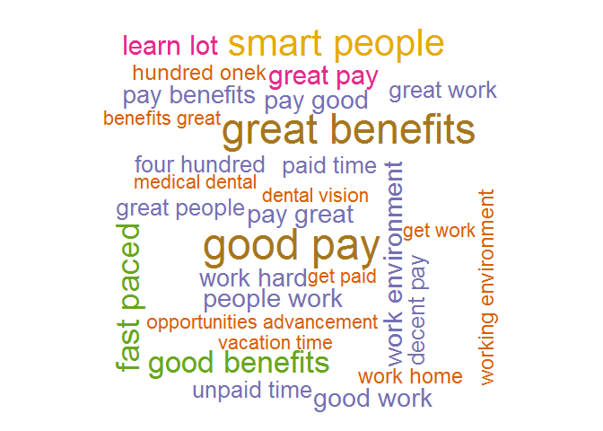
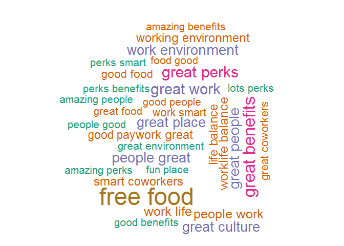
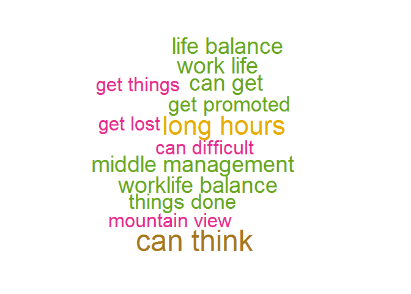
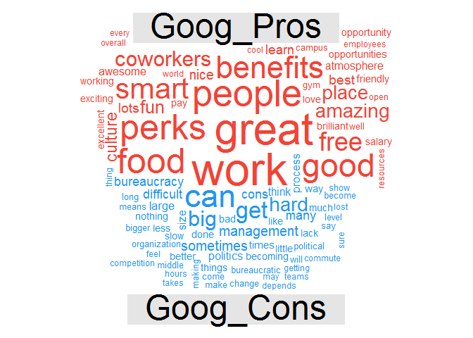
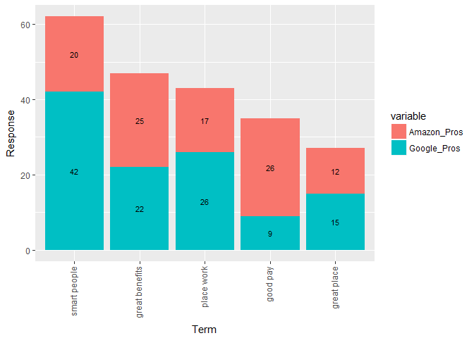
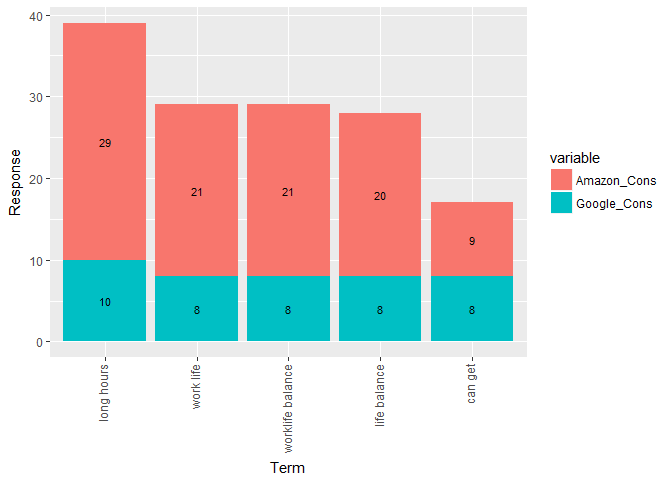

# Google vs Amazon
Mohammad Yasar Arshad  
June 12, 2017  


##1 **Load the required packages**


```r
library(tm)
```

```
## Loading required package: NLP
```

```r
library(dplyr)
```

```
## 
## Attaching package: 'dplyr'
```

```
## The following objects are masked from 'package:stats':
## 
##     filter, lag
```

```
## The following objects are masked from 'package:base':
## 
##     intersect, setdiff, setequal, union
```

```r
library(SnowballC)
library(RCurl)
```

```
## Loading required package: bitops
```

```r
library(qdap)
```

```
## Loading required package: qdapDictionaries
```

```
## Loading required package: qdapRegex
```

```
## 
## Attaching package: 'qdapRegex'
```

```
## The following objects are masked from 'package:dplyr':
## 
##     escape, explain
```

```
## Loading required package: qdapTools
```

```
## 
## Attaching package: 'qdapTools'
```

```
## The following object is masked from 'package:dplyr':
## 
##     id
```

```
## Loading required package: RColorBrewer
```

```
## 
## Attaching package: 'qdap'
```

```
## The following object is masked from 'package:dplyr':
## 
##     %>%
```

```
## The following objects are masked from 'package:tm':
## 
##     as.DocumentTermMatrix, as.TermDocumentMatrix
```

```
## The following object is masked from 'package:NLP':
## 
##     ngrams
```

```
## The following object is masked from 'package:base':
## 
##     Filter
```

```r
library(wordcloud)
library(RWeka)
library(plotly)
```

```
## Loading required package: ggplot2
```

```
## 
## Attaching package: 'ggplot2'
```

```
## The following object is masked from 'package:qdapRegex':
## 
##     %+%
```

```
## The following object is masked from 'package:NLP':
## 
##     annotate
```

```
## 
## Attaching package: 'plotly'
```

```
## The following object is masked from 'package:ggplot2':
## 
##     last_plot
```

```
## The following object is masked from 'package:qdap':
## 
##     %>%
```

```
## The following object is masked from 'package:stats':
## 
##     filter
```

```
## The following object is masked from 'package:graphics':
## 
##     layout
```

```r
library(reshape2)
```

##2 **Load the dataset**


```r
amazon_url <-
getURL(
'http://s3.amazonaws.com/assets.datacamp.com/production/course_935/datasets/500_amzn.csv',
ssl.verifyhost = FALSE,
ssl.verifypeer = FALSE
)
amazon <- read.csv(textConnection(amazon_url), header = TRUE)


google_url <-
getURL(
'http://s3.amazonaws.com/assets.datacamp.com/production/course_935/datasets/500_goog.csv',
ssl.verifyhost = FALSE,
ssl.verifypeer = FALSE
)
google <- read.csv(textConnection(google_url), header = TRUE)
```

#### **Amazon Pros**


```r
amzn_pros <- amazon$pros
amzn_pros <- amzn_pros[!is.na(amzn_pros)]
```

#### **Amazon Cons**

```r
amzn_cons <- amazon$cons
amzn_cons <- amzn_cons[!is.na(amzn_cons)]
```
#### **Google Pros**

```r
goog_pros <- google$pros
goog_pros <- goog_pros[!is.na(goog_pros)]
```
#### **Google Cons**

```r
goog_cons <- google$cons
goog_cons <- goog_cons[!is.na(goog_cons)]
```

##3 **Create the cleaning and Word Cloud Functions**


```r
#STEP 1: qdap_clean function

qdap_clean <- function(x) {
  x <- replace_number(x)
  x <- replace_symbol(x)
  x <- replace_abbreviation(x)
  x <- replace_contraction(x)
  x <- replace_ordinal(x)
  x <- tolower(x)
  return(x)
}


# STEP 2: Corpus cleaning function using "tm"


tm_clean <- function(corpus) {
  corpus<- tm_map(corpus, removePunctuation)
  corpus <- tm_map(corpus, stripWhitespace)
  corpus <- tm_map(corpus, removeWords,
                   c(stopwords("en"), "Google","google","amazon", "Amazon","company"))
  return(corpus)
}


create_wordcloud = function(corpus, color) 
{
  pal = brewer.pal(n = 7, name = color)
  tokenizer = function(x) {NGramTokenizer(x, Weka_control(min = 2, max = 2))}
  corpus_tdm = TermDocumentMatrix(corpus, control = list(tokenize = tokenizer))
  corpus_tdm = removeSparseTerms(x = corpus_tdm, sparse = 0.99)
  corpus_tdm = as.data.frame(as.matrix(corpus_tdm))
  corpus_tdm_freq = rowSums(corpus_tdm)
  return(wordcloud(names(corpus_tdm_freq), freq = corpus_tdm_freq, scale = c(3.0, 1.0), colors = pal, min.freq = 3) )
}
```

##4 **Create Corpus **


```r
amzn_pros_corp <- tm_clean(VCorpus(VectorSource(qdap_clean(amzn_pros))))

amzn_cons_corp <- tm_clean(VCorpus(VectorSource(qdap_clean(amzn_cons))))

goog_pros_corp <- tm_clean(VCorpus(VectorSource(qdap_clean(goog_pros))))

goog_cons_corp <- tm_clean(VCorpus(VectorSource(qdap_clean(goog_cons))))
```


##5 **Create Wordclouds**

###5a Amazon Pros Wordcloud

```r
create_wordcloud(corpus = amzn_pros_corp, color = "Dark2")
```

```
## Warning in wordcloud(names(corpus_tdm_freq), freq = corpus_tdm_freq, scale
## = c(3, : place work could not be fit on page. It will not be plotted.
```

```
## Warning in wordcloud(names(corpus_tdm_freq), freq = corpus_tdm_freq, scale
## = c(3, : great place could not be fit on page. It will not be plotted.
```

```
## Warning in wordcloud(names(corpus_tdm_freq), freq = corpus_tdm_freq, scale
## = c(3, : work hours could not be fit on page. It will not be plotted.
```

<!-- -->

###5b Amazon Cons Wordcloud

```r
create_wordcloud(corpus = amzn_cons_corp, color = "Dark2")
```

<!-- -->

###5c Google Pros Wordcloud

```r
create_wordcloud(corpus = goog_pros_corp, color = "Dark2")
```

```
## Warning in wordcloud(names(corpus_tdm_freq), freq = corpus_tdm_freq, scale
## = c(3, : smart people could not be fit on page. It will not be plotted.
```

```
## Warning in wordcloud(names(corpus_tdm_freq), freq = corpus_tdm_freq, scale
## = c(3, : place work could not be fit on page. It will not be plotted.
```

<!-- -->

###5d Google Cons Wordcloud

```r
create_wordcloud(corpus = goog_cons_corp, color = "Dark2")
```

<!-- -->


##6 **Create Comparison Cloud**

###6a Clean the text using qdap function


```r
amzn_pros_cc <- qdap_clean(amzn_pros)
amzn_cons_cc <- qdap_clean(amzn_cons)
goog_pros_cc <- qdap_clean(goog_pros)
goog_cons_cc <- qdap_clean(goog_cons)
```

###6b Merge the pros and cons for comparison


```r
amznproscc <- paste(amzn_pros_cc, collapse = "")
amznconscc <- paste(amzn_cons_cc, collapse="")
googproscc <- paste(goog_pros_cc, collapse= "")
googconscc <- paste(goog_cons_cc, collapse= "")
amzn_all <- c(amznproscc, amznconscc)
goog_all <- c(googproscc, googconscc)
```

###6c. Clean the Corpus, Create TDM and create matrix for comparison cloud


```r
amzn_all_clean <- tm_clean(VCorpus(VectorSource(amzn_all)))
goog_all_clean <- tm_clean(VCorpus(VectorSource(goog_all)))

amzn_all_tdm <- TermDocumentMatrix(amzn_all_clean)
goog_all_tdm <- TermDocumentMatrix(goog_all_clean)

colnames(amzn_all_tdm) <- c("Amzn_Pros", "Amzn_Cons")
colnames(goog_all_tdm) <- c("Goog_Pros", "Goog_Cons")
amzn_all_m <- as.matrix(amzn_all_tdm)
goog_all_m <- as.matrix(goog_all_tdm)
```

###6d Comparison Cloud for Amazon


```r
comparison.cloud(amzn_all_m, colors = c("#F44336", "#2196f3"), max.words = 100)
```

<!-- -->

###6e Comparison Cloud for Google


```r
comparison.cloud(goog_all_m, colors = c("#F44336", "#2196f3"), max.words = 100)
```

```
## Warning in comparison.cloud(goog_all_m, colors = c("#F44336", "#2196f3"), :
## environment could not be fit on page. It will not be plotted.
```

```
## Warning in comparison.cloud(goog_all_m, colors = c("#F44336", "#2196f3"), :
## interesting could not be fit on page. It will not be plotted.
```

```
## Warning in comparison.cloud(goog_all_m, colors = c("#F44336", "#2196f3"), :
## compensation could not be fit on page. It will not be plotted.
```

<!-- -->


##7 **Common Bigram Word Analysis**

###7a Prepare the data

```r
amzn_pros_df <- data.frame(text=unlist(sapply(amzn_pros_corp, '[',"content")),stringsAsFactors=F)
token_delim <- " \\t\\r\\n.!?,;\"()"
bi_amzn_pros <- NGramTokenizer(amzn_pros_df, Weka_control(min=2,max=2, delimiters = token_delim))
bi_amzn_pros_df <- data.frame(table(bi_amzn_pros))


amzn_cons_df <- data.frame(text=unlist(sapply(amzn_cons_corp, '[',"content")),stringsAsFactors=F)
token_delim <- " \\t\\r\\n.!?,;\"()"
bi_amzn_cons <- NGramTokenizer(amzn_cons_df, Weka_control(min=2,max=2, delimiters = token_delim))
bi_amzn_cons_df <- data.frame(table(bi_amzn_cons))

goog_pros_df <- data.frame(text=unlist(sapply(goog_pros_corp, '[',"content")),stringsAsFactors=F)
token_delim <- " \\t\\r\\n.!?,;\"()"
bi_goog_pros <- NGramTokenizer(goog_pros_df, Weka_control(min=2,max=2))
bi_goog_pros_df <- data.frame(table(bi_goog_pros))


goog_cons_df <- data.frame(text=unlist(sapply(goog_cons_corp, '[',"content")),stringsAsFactors=F)
token_delim <- " \\t\\r\\n.!?,;\"()"
bi_goog_cons <- NGramTokenizer(goog_cons_df, Weka_control(min=2,max=2, delimiters = token_delim))
bi_goog_cons_df <- data.frame(table(bi_goog_cons))
```

###7b Top 5 common bigram words in Pros reviews

```r
all_pros_df <- left_join(bi_amzn_pros_df,bi_goog_pros_df, by=c("bi_amzn_pros" = "bi_goog_pros"),stringsAsFactors=F)
```

```
## Warning in left_join_impl(x, y, by$x, by$y, suffix$x, suffix$y): joining
## factors with different levels, coercing to character vector
```

```r
colnames(all_pros_df) <-c("Term","Amazon_Pros" ,"Google_Pros") 
all_pros_df <- na.omit(all_pros_df)
all_pros_df$Total <-(all_pros_df[, 2] +all_pros_df[, 3])
all_pros_total <- all_pros_df %>% arrange(desc(Total)) %>% head(5)

all_pros_total_m <- 
  melt(all_pros_total, id.vars = ("Term"), measure.vars = 
         c("Amazon_Pros", "Google_Pros"), variable.names= 
         "Pros", value.name = "Response")
all_pros_total_m$Term <- factor(all_pros_total_m$Term, levels = all_pros_total$Term)

ggplot(all_pros_total_m, aes(x = Term, y = Response, group = variable)) + 
  geom_col(aes(fill=variable)) +
  theme(axis.text.x = element_text(angle = 90, hjust = 1, vjust = 0.25)) +
  geom_text(aes(label = Response), position = position_stack(vjust = .5), size = 3)  # labels inside the bar segments
```

<!-- -->

###7c Top 5 common bigram words in Cons reviews

```r
all_cons_df <-left_join(bi_amzn_cons_df,bi_goog_cons_df, by=c("bi_amzn_cons" = "bi_goog_cons"),stringsAsFactors=F) #to find out the common words between two companies
```

```
## Warning in left_join_impl(x, y, by$x, by$y, suffix$x, suffix$y): joining
## factors with different levels, coercing to character vector
```

```r
colnames(all_cons_df) <-c("Term","Amazon_Cons" ,"Google_Cons") 
all_cons_df <- na.omit(all_cons_df) # 
all_cons_df$Total <-(all_cons_df[, 2] +all_cons_df[, 3])
all_cons_total <- all_cons_df %>% arrange(desc(Total)) %>% head(5)

all_cons_total_m <- 
  melt(all_cons_total, id.vars = ("Term"), measure.vars = 
         c("Amazon_Cons", "Google_Cons"), variable.names= 
         "Pros", value.name = "Response")
all_cons_total_m$Term <- factor(all_cons_total_m$Term, levels = all_cons_total$Term)

ggplot(all_cons_total_m, aes(x = Term, y = Response, group = variable)) + 
  geom_col(aes(fill=variable)) +
  theme(axis.text.x = element_text(angle = 90, hjust = 1, vjust = 0.25)) +
  geom_text(aes(label = Response), position = position_stack(vjust = .5), size = 3)  # labels inside the bar segments
```

<!-- -->


